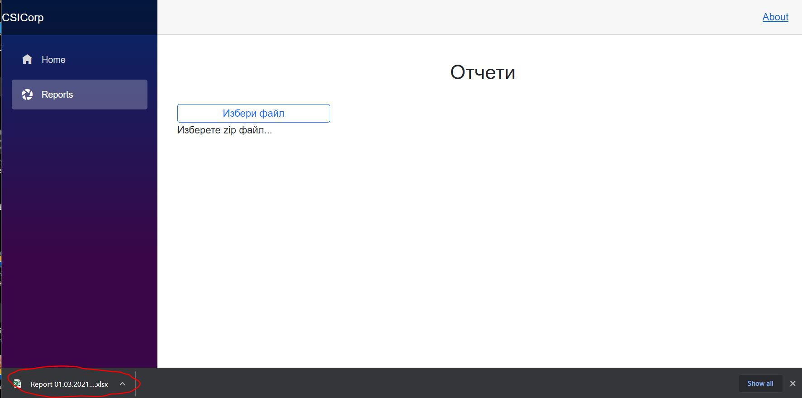

#  **CSICorp INTELLIGENT SYSTEMS**

<table  border = '0' style="width: 100%;">
  <tr>
    <td>
        
    </td>
    <td> 

## CSICorp INTELLIGENT SYSTEMS
### Костадин Караиванов

</tr>
</table>
 

# Демо на система и функционалност относно обработка и представянето на структурирани данни  от системата Trimble 4D
 

## **Общ преглед**

> ***Демо версия на приложение за генериране на отчет във формат xlsx, необходим за анализ на данните и изготвяне на седмична справка. Приложението обработва данни от системата Trimble 4D, експортнати във формат csv. Експортите от всеки ден са поставени в архив, който се подава на приложението за изчисляване.***
>  
> 
> ***Предстои добавяне на функционалност за обработване и сравнение на динните от предишен период, необходими при анализа и формиране на седмичната справка.***
---

## **Спецификация**

> #### Приложението е базирано на [.NET Core](https://en.wikipedia.org/wiki/.NET_Core) фреймуорк и [WASM](https://en.wikipedia.org/wiki/WebAssembly) Blazor технологията.   
> * #### За frondEnd, като програмен език са използвани HTML, CSS и JS, но на този етап от проекта не се използват Cookies, Local и Session storage.
> * #### За backhend, като програмен език е използван C#, който реализира функционалността по изчисление на входните данни и генериране на отчет във файла на [Microsoft Office](https://www.microsoft.com).
---

## **Функционалност**

> #### __*От началната страница кликнете на бутона "Reports"*__
>    
__*На страница "Reports" кликнете на бутона "Избери файл". За демото може да свалите файл от посочените линкове по-долу.*__
>   
__*След избор на файл /zip архив/ ще бъдете препратени към изглед с информация за всеки файл намиращ се в архива, както и данните от всеки файл, които предстои да бъдат изчислени.*__
>   
__*Най-отдолу във формата кликнете на бутона "Преглид в таблица". Бутонът "Изтрии всичко" ще Ви върне на предишна стъпка за избор на нов файл с данни.*__
>   
__*На генерирания предварителен отчет, най-отдолу се намират три бутона.*__
>   
>  __*Бутонът "Избери предходен период" в демото не функционира поради липса на входни параметри. Бутонът "Изтрии всичко" ще Ви върне на предишна стъпка за избор на нов файл с данни. Бутонът "Създай отчет" ще ви препрати към съгласие за създаване на отчет.*__
>   
__*След съгласие чрез бутон "Ок" ще се генерира файл, който е готов за анализ и изготвяне на седмичната справка.*__
> 
>  
> 
>  
> 
 

<table  border = '0' style="width: 100%;">
  <tr>
    <td>
        
    </td>
    <td> 

## CSICorp INTELLIGENT SYSTEMS

</tr>
</table>
 

#### ***Адрес за тест на приложението ***[CSICorp](http://asarel.csicorp.eu)***. Файлове с които да тествате изчислените данни и генериране на xlsx файл - [вариан 1](./DataForTest/9%20week.zip), [вариант 2](./DataForTest/8%20week.zip)***